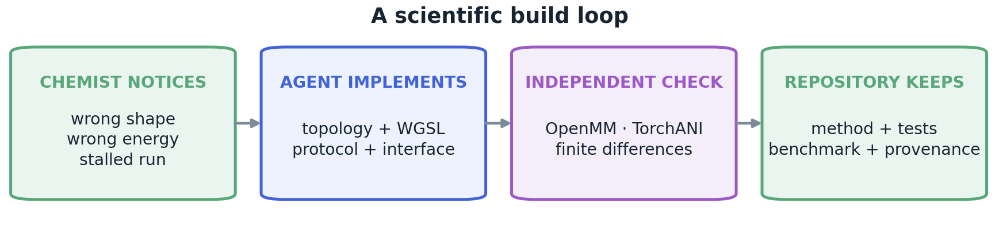
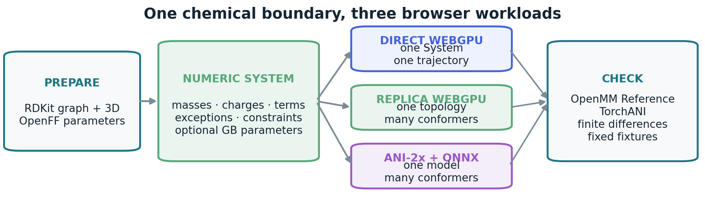

# Molecular design software is now free

## Building a browser molecular workbench with GPT-5.6 Sol

Rafal P. Wiewiora and Woody Sherman
PsiThera, Watertown, MA

Draft - August 2026

What happens when a chemist asks a coding agent for the molecular-design environment they actually
want, then refuses to accept toy chemistry? Over several days, that conversation produced Molarium:
a public browser workbench for three-dimensional editing, protein preparation, conformer search,
molecular mechanics, ANI-2x, and short-chain protein prediction. GPT-5.6 Sol did not merely connect
existing commands. It wrote browser-native Sage forces, OBC2/ACE solvent, SHAKE/RATTLE constraints,
a homogeneous-replica molecular dynamics engine, and ANI-2x descriptor and force kernels. We tested
those parts against OpenMM, TorchANI, finite differences, and fixed fixtures.

The artifact is therefore more than another software release. It is evidence that, under expert
direction, a current model can turn published methods into substantial, inspectable scientific code
while the research conversation is still under way. Equations and parameters made the new
implementations testable; trained weights and accumulated validation still had to be preserved and
reused.

> **The result is not merely that an agent can operate scientific software. A chemist asked for
> missing software, tested it while it was being written, and kept the resulting methods as
> inspectable code.**

## A molecule should not disappear into its software

Molecular design begins with an act of spatial imagination: a chemist sees a molecule that does not
yet exist. It is a beautiful job, and its software should honor it. Instead, the idea is often broken
into a drawing package, a preparation wizard, a simulation script, a queue, and a different viewer
for the answer. Each handoff asks the chemist to remember what the software has forgotten. The tools
become the work.

We wanted the opposite feeling: the quiet pleasure of software that simply works. The molecule
should turn when the chemist turns it. A carbonyl-to-enol edit should remain in front of them until
both bond-order changes are finished. A calculation should return to the same scene, not to an
anonymous output directory. The machinery should recede so that attention can stay with shape,
strain, water, and the next chemical idea.

### Why the browser, and why now

For many years the browser was mainly a viewer or a front end to a remote calculation. WebAssembly
made mature C and C++ libraries portable and sandboxed. WebGPU then exposed modern GPU buffers,
compute shaders, and command queues through one browser API. WebAssembly can handle graph
operations, formats, control flow, and reference calculations; WebGPU can handle repeated
floating-point work across atoms or conformers; workers can keep both away from the interface
thread. The result can be served as static files while structures and supported calculations remain
on the user's device.

The more provocative result is not the interface but how it appeared. The first instruction was
almost unserious: build a copy of an existing molecular viewer. Minutes later the first benzene was
visibly wrong. "Can you actually test all this out?" became the governing question. A methyl fragment
made a false bond; a trifluoromethyl group arrived flat; changing one bond order prematurely bent an
oxygen and rotated a ligand. Each visual objection became a test and then a change in the model of
the molecule. Bond perception was separated from drawing; fragments received three-dimensional
starting conformations; coupled edits were staged; cleanup was restricted to the atoms near the
change.

The same pattern drove the numerics. "Is this a real force field?" killed an early toy evaluator and
moved the project to RDKit MMFF/UFF and prepared OpenFF Sage Systems. A disagreement between CPU and
GPU energies exposed both a unit mistake and an architectural misunderstanding: OpenMM Reference in
WebAssembly was a CPU oracle, not the WebGPU engine. "Wait - aren't we using WebGPU?" led to analytic
WGSL forces, then compact sparse buffers, then tests on Trp-cage and ubiquitin. Asking for implicit
solvent led to OBC2/ACE; asking whether that included SHAKE led to fixed-point SHAKE/RATTLE; a
100,000-step run that stopped immediately exposed a forgotten 5,000-step validation cap. This was
not a model producing a finished application from one prompt. It was a chemist noticing the wrong
thing on screen and an agent turning that objection into code, repeatedly.

Visual and numerical failures produced code changes. Independent oracles decided whether those
changes survived. Accepted methods stayed with their tests, benchmarks, and provenance.

That history gives "free" four meanings:

1. **Free to use.** The public artifact has no license fee and need not upload supported
   calculations.
2. **Free to rebuild.** *We now take seriously the possibility that a sufficiently specified method
   can be implemented from its paper during a project, rather than awaited as a product.*
3. **Free to preserve.** The repository can keep agent-written methods long enough for other
   scientists to inspect, test, and improve them.
4. **Free to compose.** A common interface and explicit protocol can make methods plug-and-play for
   chemists and for agents running reproducible benchmarks end to end.

This is different from asking a model to call a fixed toolchain. Orchestration is right when trusted
programs and trained models already exist. Accordingly, Molarium keeps RDKit, OpenMM, ONNX Runtime,
and the official ANI-2x and OpenFold weights. GPT-5.6 Sol wrote the missing browser-specific layers.
Classical mechanics is unusually amenable to this division: equations, parameters, units, and
reference values can make a new implementation answerable to independent calculation. A neural
architecture alone cannot recreate its weights or its biological evidence.

## The experiment as it unfolded

By the end of the conversation, opening Molarium felt less like launching a suite than picking up
one persistent molecular model. The 7KPA protein-ligand complex can be prepared, inspected, edited,
and locally relaxed without leaving its scene. The preparation path resolves alternate locations
and explicit connectivity, repairs supported residue atoms, adds hydrogens, and keeps a
crystallographic water when its geometry supports a ligand-protein bridge. It does not conceal
unresolved chemistry behind a green button.

- **View** keeps chains, ligand, waters, contacts, and the selected residue together.
- **Build** stages bond-order, charge, and hydrogen edits before cleanup moves the structure.
- **Inspect** returns aligned trajectories to the same canvas while preserving raw coordinates.

## What the browser had to learn

The browser is liberating precisely because it refuses the usual assumptions. There may be no
Python, compiler, CUDA driver, or filesystem path that survives the next machine. WebAssembly gives
mature C/C++ code a portable sandbox; WebGPU gives the page buffers, compute shaders, and command
queues, but only fast f32 arithmetic and no portable 64-bit atomics. The solution was not to pretend
that these constraints did not exist. It was to make them the architecture.

Chemical preparation ends at a numeric System: explicit masses, charges, bonded terms,
Lennard-Jones parameters, exceptions, constraints, and optional generalized Born parameters. GPU
kernels never guess atom types. Browser small molecules use OpenFF Sage 2.1. Bundled protein
fixtures preserve exact numeric Systems exported from OpenFF Rosemary 3.0.0-alpha0 with NAGL
charges.

- **One System, one trajectory.** Atom-centric WGSL kernels evaluate analytic Sage valence,
  Coulomb, Lennard-Jones, and OBC2/ACE forces from sparse incidence buffers.
- **One topology, many replicas.** A second engine adds a replica dimension to every kernel. It
  borrows STORMM's synthesis idea, not its source code. Split-int64 force accumulation and
  fixed-point coordinates replace missing 64-bit atomics; replica-local SHAKE/RATTLE permits a 2 fs
  Langevin step.
- **One model, many conformers.** WGSL builds ANI-2x atomic environment vectors, ONNX Runtime
  evaluates the official eight TorchANI networks, and WGSL contracts derivatives back to coordinate
  forces without a CPU round trip.

Each path has a deliberately narrow contract. The replica engine accepts homogeneous topologies,
nonperiodic implicit solvent, and no PME; long-time stability is not yet established. The ANI-2x
path is a vacuum model for neutral, closed-shell molecules of at most 96 supported atoms. OpenFold 2
is the opposite case: its scientific content is in trained weights, so the browser runs the existing
model locally rather than claiming to reconstruct it.

> **Equations can be reconstructed and checked. Trained weights, parameter sets, and accumulated
> experimental evidence must be preserved.**

Every fast path answers to slower code. OpenMM 8.2 Reference WebAssembly re-evaluates the same
numeric System in double precision; native TorchANI checks ANI; finite differences check forces.
Reference code is a test instrument, not a user-facing fallback. Agreement checks arithmetic, but
shared parameters do not independently validate force-field assignment.

## The conformer experiment

Conformer search became the first place where all of these choices met. The useful result was not
one photogenic minimum but a diverse, inspectable set whose provenance stayed visible. RDKit
generates up to 64 symmetry-pruned ETKDGv3 seeds and briefly polishes them with MMFF94 or UFF. The
replica schedule then applies 2,500 Langevin steps at 600, 450, and 300 K, followed by 240 fixed-step
Sage relaxation iterations in OBC2/ACE. This final stage is a bounded relaxation, not a converged
minimizer. Symmetry-aware heavy-atom RMSD removes duplicates before clustering and SDF export.

> **ETKDGv3 seeds; MMFF94/UFF polish; Sage replica dynamics; common Sage and ANI scores;
> symmetry-aware clustering.**

The comparison retains three generators from the same seeds: MMFF-polished coordinates,
replica/Sage coordinates, and ANI-2x-refined coordinates. All final coordinates receive a common
Sage/OBC2 energy and, for supported molecules, a vacuum ANI-2x energy. The common Sage score makes
the generators comparable and checks replica-engine parity on identical coordinates. It is not an
independent physical oracle because the replica lane optimizes the same objective.

In an eight-molecule development panel, replica search found a lower common Sage minimum for four
molecules. The median best-energy gain was only 0.128 kcal/mol. It added 75 structural clusters,
including 44 within 3 kcal/mol that were absent from the seed lane's window. The current evidence
supports faster exploration and added diversity. It does not establish better conformer quality in
general.

## What survived measurement

The first honest result was negative: a GPU is a poor place to launch one tiny molecule. OpenMM
Reference was 13.3x faster for one C16 and 3.5x faster for one water27 because GPU dispatch dominates
tiny jobs. Larger or batched work reversed the result. Direct WebGPU reached 2.09x the Reference
throughput for 304-atom Trp-cage, 9.16x for 1,231-atom vacuum ubiquitin, and 25.6x for ubiquitin with
OBC2/ACE. At equal aggregate steps, 1,024 C16 replicas reached 10.3x and 256 water27 replicas 24.1x
the Reference throughput. The baseline is double-precision OpenMM Reference WebAssembly, not native
CPU or CUDA. Replica timings exclude setup and readback, and the integrators differ.

> **WebGPU did not make one small molecule fast. It made enough molecular work fast.**

Direct Sage's largest relative energy deviation from OpenMM was 2.361e-6; aspirin force relative RMS
was 7.696e-7. Aspirin OBC2 differed by 1.279e-4 kcal/mol with 7.835e-7 force relative RMS. The replica
engine's largest energy error was 2.15e-5 kcal/mol and force relative RMS was 6.66e-6. Against native
TorchANI on six small molecules, ANI-2x reached 0.02572 kcal/mol maximum energy error and 1.022e-5
force relative RMS. These fixtures test implementation parity, not force-field accuracy, ANI
transferability, or cross-vendor agreement. The 418 browser checks prevent product regressions; they
are not 418 scientific validations.

## What this does - and does not - show

The engines are nonperiodic and omit PME, barostats, membranes, and arbitrary OpenMM plugins. The
single-precision, all-pairs replica engine accepts one topology at a time. OBC2 and browser protein
parameterization remain experimental; ANI-2x is a restricted vacuum model; OpenFold supports one
short chain and uses a network service only for a user-requested MSA. Next tests require a frozen
conformer benchmark with repeated seeds, reference-conformer recall, an independent energy judge,
confidence intervals, a matched modern CPU baseline, a cross-GPU matrix, and longer NVE and
constrained-solvent trajectories.

The conversation is part of the evidence, not decoration. We are preserving its timestamped
transcript alongside commits, test outputs, benchmark artifacts, and file hashes, with credentials
and private structure data removed before public release. Until active time is reconstructed from
that archive, "several days" denotes the observed project interval rather than a controlled
productivity measurement.

Molarium is public at https://molarium.org; source is at
https://github.com/rafwiewiora/molarium. We began by asking for a nicer place to look at molecules.
We ended with a sharper proposition: a chemist can now ask for missing scientific software during
the work itself, watch it fail, demand the relevant comparison, and keep the resulting method as a
public, testable artifact. GPT-5.6 Sol supplied extraordinary implementation speed. The chemist
supplied the taste to notice a flat trifluoromethyl group, the suspicion to question an energy scale, and the judgment
to decide which failure mattered. Neither role is dispensable. The exciting future is not chemistry
without chemists; it is chemistry in which beautiful ideas no longer have to wait for beautiful
tools.

## References

1. Haas A, et al. WebAssembly. *PLDI* (2017).
2. W3C GPU for the Web Working Group. [WebGPU specification](https://www.w3.org/TR/webgpu/).
3. Rose AS, Hildebrand PW. NGL Viewer. *Nucleic Acids Research* 43, W576-W579 (2015).
4. Eastman P, et al. OpenMM 8. *J Phys Chem B* 128, 109-116 (2024).
   [doi:10.1021/acs.jpcb.3c06662](https://doi.org/10.1021/acs.jpcb.3c06662).
5. Landrum G. RDKit: open-source cheminformatics, Release 2025.03.4.
   [doi:10.5281/zenodo.591637](https://doi.org/10.5281/zenodo.591637).
6. Riniker S, Landrum GA. Better informed distance geometry for conformer generation. *J Chem Inf
   Model* 55, 2562-2574 (2015). [doi:10.1021/acs.jcim.5b00654](https://doi.org/10.1021/acs.jcim.5b00654).
7. Wang S, et al. ETKDG conformer generation for small rings and macrocycles. *J Chem Inf Model* 60,
   2044-2058 (2020). [doi:10.1021/acs.jcim.0c00025](https://doi.org/10.1021/acs.jcim.0c00025).
8. Halgren TA. Merck molecular force field I: MMFF94. *J Comput Chem* 17, 490-519 (1996).
9. Rappé AK, et al. UFF. *J Am Chem Soc* 114, 10024-10035 (1992).
   [doi:10.1021/ja00051a040](https://doi.org/10.1021/ja00051a040).
10. Boothroyd S, et al. Open Force Field 2.0.0: Sage. *J Chem Theory Comput* 19, 3251-3275 (2023).
    [doi:10.1021/acs.jctc.3c00039](https://doi.org/10.1021/acs.jctc.3c00039).
11. Onufriev A, Bashford D, Case DA. Modified generalized Born model. *Proteins* 55, 383-394 (2004).
    [doi:10.1002/prot.20033](https://doi.org/10.1002/prot.20033).
12. Schaefer A, Karplus M. Analytical continuum electrostatics. *J Phys Chem* 100, 1578-1599 (1996).
    [doi:10.1021/jp9521621](https://doi.org/10.1021/jp9521621).
13. Ryckaert J-P, Ciccotti G, Berendsen HJC. SHAKE constraints. *J Comput Phys* 23, 327-341 (1977).
    [doi:10.1016/0021-9991(77)90098-5](https://doi.org/10.1016/0021-9991(77)90098-5).
14. Andersen HC. RATTLE. *J Comput Phys* 52, 24-34 (1983).
    [doi:10.1016/0021-9991(83)90014-1](https://doi.org/10.1016/0021-9991(83)90014-1).
15. Cerutti DS, Wiewiora R, Boothroyd S, Sherman W. STORMM. *J Chem Phys* 161, 032501 (2024).
    [doi:10.1063/5.0211032](https://doi.org/10.1063/5.0211032).
16. Gao X, et al. TorchANI. *J Chem Inf Model* 60, 3408-3415 (2020).
    [doi:10.1021/acs.jcim.0c00451](https://doi.org/10.1021/acs.jcim.0c00451).
17. Devereux C, et al. ANI-2x: extending ANI to sulfur and halogens. *J Chem Theory Comput* 16,
    4192-4202 (2020). [doi:10.1021/acs.jctc.0c00121](https://doi.org/10.1021/acs.jctc.0c00121).
18. Microsoft. [ONNX Runtime](https://onnxruntime.ai/), Web release 1.27.0.
19. Open Force Field Initiative. OpenFF Rosemary 3.0.0-alpha0 and NAGL
    `openff-gnn-am1bcc-1.0.0`; exact fixture provenance is archived with
    [Molarium](https://github.com/rafwiewiora/molarium/tree/main/openff).
20. Ahdritz G, et al. OpenFold. *Nature Methods* 21, 1514-1524 (2024).
    [doi:10.1038/s41592-024-02272-z](https://doi.org/10.1038/s41592-024-02272-z).
21. Protein Data Bank. Structure 7KPA. [doi:10.2210/pdb7KPA/pdb](https://doi.org/10.2210/pdb7KPA/pdb).
22. OpenAI. GPT-5.6 Sol. Model-assisted development record, prompts, commits, test artifacts, and
    hashes are described in the [Molarium provenance archive](PROVENANCE-ARCHIVE.md) (2026).
23. Anthropic. [Claude accelerates protein design](https://www.anthropic.com/research/Claude-accelerates-protein-design)
    (2026).
24. OpenAI. [Introducing new capabilities to GPT-Rosalind](https://openai.com/index/introducing-new-capabilities-to-gpt-rosalind/)
    (2026).
